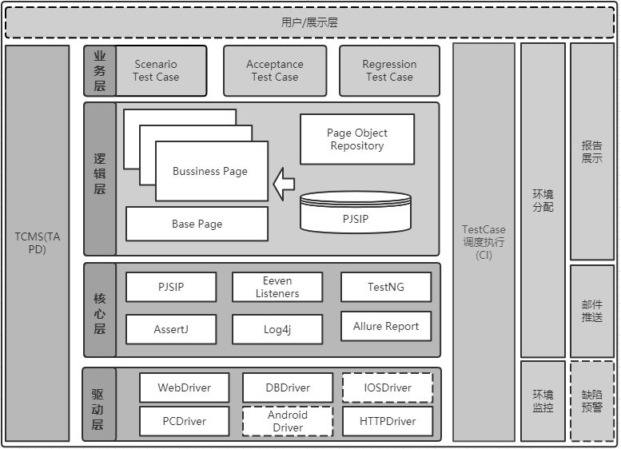
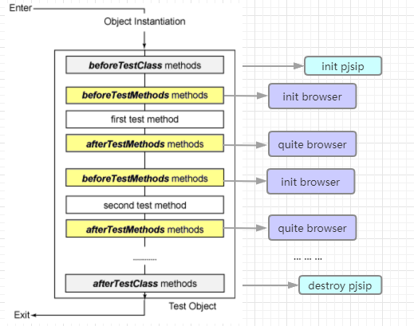
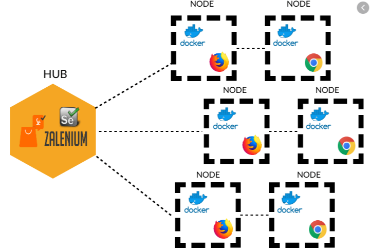
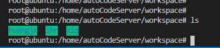

<font size=10>**UIAuto**</font>
- [Summary](#summary)
- [技术栈](#技术栈)
- [Framework](#framework)
- [TestNG 介绍](#testng-介绍)
- [Allure Test Report 介绍](#allure-test-report-介绍)
- [Zalenium 介绍](#zalenium-介绍)
- [Jenkins 介绍](#jenkins-介绍)
- [运行环境](#运行环境)
  - [Local](#local)
  - [Remote](#remote)
- [目录结构](#目录结构)
- [用例编写](#用例编写)
  - [用例模式 PageObject](#用例模式-pageobject)
  - [用例组成](#用例组成)
  - [用例注解](#用例注解)
  - [用例步骤](#用例步骤)
    - [步骤描述](#步骤描述)
    - [具体步骤](#具体步骤)
  - [用例验证](#用例验证)
  - [用例执行](#用例执行)
  - [报告查看](#报告查看)
- [P Series 应用](#p-series-应用)
    - [全局配置文件 config.properties](#全局配置文件-configproperties)
    - [用户配置文件 data.properties](#用户配置文件-dataproperties)
    - [通过 Jenkins 执行用例](#通过-jenkins-执行用例)
      - [KeyWord Job](#keyword-job)
      - [XML测试套件 Job](#xml测试套件-job)
      - [Pipline Job](#pipline-job)
      - [Run 5 Times Job](#run-5-times-job)
- [RoadMap](#roadmap)
- [FAQ](#faq)
- [Plan](#plan)
- [Code Sever 开启远程自动化编程之旅](#code-sever-开启远程自动化编程之旅)
      - [[环境准备] code server global user Setting，记录，不需要修改](#环境准备-code-server-global-user-setting记录不需要修改)
      - [Code Server 导入工程](#code-server-导入工程)
      - [Code Server 运行测试](#code-server-运行测试)
    
# Summary

【目标】
1. 提供简洁易用的自动化测试方案
2. 提高测试效率，结合DeveOps
3. 支持多产品线的自动化测试（Web,Mobile,PC）

# 技术栈
selenium + selenide + testng  + allure + zalenium + docker + maven + jenkins 

# Framework


# TestNG 介绍 

TestNG 是一个开源自动化测试框架;TestNG表示下一代(Next Generation的首字母)。 TestNG 类似于JUnit(特别是JUnit 4)，但它不是JUnit框架的扩展。它的灵感来源于JUnit。它的目的是优于JUnit，尤其是在用于测试集成多类时。

 TestNG的创始人是Cedric Beust(塞德里克·博伊斯特)。




【扩展】http://www.51testing.com/zhuanti/TestNG.htm

【扩展】https://testng.org/doc/
# Allure Test Report 介绍
 Allure - an open-source framework designed to create test execution reports that are clear to everyone in the team.

# Zalenium 介绍



Selenium Grid 是基于Selenium RC的，作用就是分布式执行测试,而这所谓的分布式结构就是由一个hub节点和若干个node代理节点组成。Hub用来管理各个代理节点的注册信息和状态信息，并且接受远程客户端代码的请求调用，然后把请求的命令转发给代理节点来执行。 

Zalenium 是对Selenium Grid 进行容器化扩展的应用，提供便捷的使用和丰富的功能。

# Jenkins 介绍

作为一个可扩展的自动化服务器,Jenkins 可以用作简单的 CI 服务器,或者变成任何项目的持续交付中心。


# 运行环境
## Local 
   *repo*

   http://192.168.5.142/caspar/swebtest.git
## Remote
  1. Code (用例编写与调试)
        http://192.168.3.252:8077/

  2. Test Browser (远端运行浏览器)
        http://192.168.3.252:4444/grid/admin/live?only_active_sessions=true

  3. Record Dashboard (录屏)
        http://192.168.3.252:4444/dashboard/#

  4. CI Integration (CI 集成，S series，P series)
        http://192.168.3.252:8087/jenkins/


# 目录结构
```
├── Readme.md                                            
├── src                                     
│   ├── main                              //源码目录                               
│   │     ├── java                        //源码
│   │     └── resources
│   │         ├── allure.properties       //report 配置文件
│   │         ├── config.properties       //main 全局配置文件
│   │         ├── libYsAutoTestPjsua.so   //pjsip so库
│   │         └── libYsAutoTestPjsua.so.2 //pjsip so库  
│   └── test                              //测试目录  
│         ├── com.yeastar
│         │    ├── page                   //page Object  
│         │    ├── testcase               //test case  
│         └── resources                   //测试资源文件  
│             ├── p_language              //P series 文案源
│             ├── data.properties         //测试数据配置文件  
│             ├── log4j2.xml              //log 配置文件  
│             └── config.properties       //测试全局配置，eg：重跑 ,分辨率，Hub，录屏等            
├── suite                                 //xml 用例套件
└── pom.xm                                //配置文件

```
# 用例编写
## 用例模式 PageObject


## 用例组成
<font color=DarkOrchi size=5>**注解**</font>+
<font color=Cyan size=5>**步骤**</font>+
<font color=#0099ff size=5>**验证**</font>

## 用例注解
|  字段           | 描述                  | 备注                             |
|  ----           | ----                 |----                              |
|Epic             |     敏捷保留字段      |report，Behaviors下级一级目录      |
|Feature          |     敏捷保留字段      |report，Behaviors下级二级目录      |
|Story            |     敏捷保留字段      |report，Behaviors下级三级目录      |
|Description      | 描述                  |
|Severity         |缺陷等级               |
|TmsLink          |关联用例               |
|Issue            |关联缺陷               |
|Test             |用例注解               |必填
|groups           |关键字段               |必填 <br>1.用例等级：P0,P1,P2 <br>2.用例名：test* <br>3.用例所属功能模块：Extension<br>4.用例所属项目：PSeries<br>5.用例所属场景：GSM,SIP


## 用例步骤
### 步骤描述
``` java
step("1:login web client");

assertStep("[VCP显示]");
```
### 具体步骤
``` java
auto.loginPage().login("0", EXTENSION_PASSWORD_NEW);

auto.extensionPage().deleAllExtension().createSipExtension("0",EXTENSION_PASSWORD).
                switchToTab("Linkus Clients").editDataByEditImage("all").editLinksClientsUserType(ExtensionPage.USER_TYPE.Manager).clickSaveAndApply();
       

```

## 用例验证
``` java

// Assert
 Assert.assertTrue(execAsterisk(PJSIP_SHOW_AOR+"1000").contains("Unable to find object 1000"));

//softAssert
softAssert.assertTrue(SSHLinuxUntils.exeCommand(DEVICE_IP_LAN, SHOW_CLI_LOG).contains("vm-duration"),"[Assert,cli确认提示音vm-duration]");
        softAssert.assertAll();

//softAssertPlus
softAssertPlus.assertThat(resultSum_before).extracting("caller", "callee", "status", "details")
                .contains(tuple(IVRListName_0 + vcpCaller, "1010 K [1010]", "Ringing", RECORD_DETAILS.EXTERNAL.getAlias()));
softAssertPlus.assertAll();
```


## 用例执行
1.TestNG


2.maven


## 报告查看


# P Series 应用
### 全局配置文件 config.properties
```
#Grid hub 服务地址
IS_RUN_REMOTE_SERVER = true
GRID_HUB_IP = 192.168.3.252
GRID_HUB_PORT = 4444


# 用例失败的重跑次数,仅支持在xml运行模式下生效
maxRunCount = 0

# 高亮显示操作的控件，default true
isHighlighter = true

# 是否录屏
RECORD_VIDEO=true

#chrome 分辨率 default 1920x1080   1366x768	1440x900 	1536x864	1600x900 	1680x1050	1920x1080	2560x1080	 2560x1440	2560 x 1600	2880 x 1800	3440x1440	3840x2160
screenResolution = 1920x1080
```
### 用户配置文件 data.properties
```
#=================P系列 被测设备信息设置======================
#网页登录用户名、密码
LOGIN_USERNAME = admin
LOGIN_PASSWORD = Yeastar202
EMAIL = yeastarautotest@163.com


#设置测试的浏览器：chrome、firefox、ie ；网页传输协议和端口号；Cloud默认端口号值为443
BROWSER = chrome
URL = https
DEVICE_PORT = 8088
DEVICE_IP_LAN = 192.168.3.127
DEVICE_IP_WAN = 192.168.11.230
DEVICE_IP_SUBNETMASK = 255.255.255.0
DEVICE_IP_GATEWAY = 192.168.11.1
DEVICE_IP_DNS = 192.168.3.1
UDP_PORT = 5060
TCP_PORT = 5060
TLS_PORT = 5061

#HTTP服务器路径，用于下载镜像
HTTP_SERVER_IMAGE = http://192.168.11.195:1234//30.11.99.99.99.bin
#火狐浏览器安装路径：根据自己电脑的火狐安装路径（自动化测试默认是使用谷歌浏览器，如果没有要求要用火狐测试，这个可不用修改）
FIREFOX_PATH = D:\\Program Files (x86)\\Mozilla Firefox\\firefox.exe

#AMI设置--Cloud需手动启用
DEVICE_AMI_IP = 192.168.105.234
AMI_PORT = 5038

#VoIP线路名称自定义--可不修改，如果对应的外线不测试，将对应的名字设置为null；sip trunk 和sps trunk必须存在
SIPTRUNK = sipRegister
SIPTRUNK2 = SIP2
IAXTRUNK = IAX1
SPS = SPS1
SPX = SPX1
ACCOUNTTRUNK = 6101Account

#物理外线，都与辅助设备2对接，填的值看设备中继页面的name，如果物理外线不测试，将相应的值设置为null，PC或CloudPBX值必须设为null
BRI_1 = BRI1-7
BRI_2 = null
FXS_1 = 2-5
#FXS_2 = 3-2
FXO_1 = FXO1-5
E1 = DIGIT2
GSM = LTE1-1
#被测设备的手机号
DEVICE_TEST_GSM = 15859219937


#网络磁盘设置--由于网络磁盘创建时网页传递给后台的参数是递增的，所以自动化执行时无法判断出是第几个建立的；可通过df查看是第几个，如果设备之前未创建过网络磁盘，则可以正常设置；
#建议测试录音时使用外接存储设备，将NETWORK_DEVICE_NAME设置为“null”
NETWORK_DEVICE_NAME = 11.195
NETWORK_DEVICE_IP = 192.168.11.195
NETWORK_DEVICE_SHARE_NAME = tftp
NETWORK_DEVICE_USER_NAME = yeastar
NETWORK_DEVICE_USER_PASSWORD = q

#录音存储设置：sharetest1、TF/SD、USB、HD
DEVICE_RECORD_NAME = null

```
用户分辨率配置 > 全局的用户配置
```
#chrome 分辨率 default 1920x1080   1366x768	1440x900 	1536x864	1600x900 	1680x1050	1920x1080	2560x1080	 2560x1440	2560 x 1600	2880 x 1800	3440x1440	3840x2160
screenResolution = 1920x1080
```


### 通过 Jenkins 执行用例
#### KeyWord Job
*通过关键字运行用例*

http://192.168.3.252:8087/jenkins/view/PBX_P/job/yeastar-autotest-p-series-all-testcase-keyword-debug/
#### XML测试套件 Job
*执行XML测试套件*

http://192.168.3.252:8087/jenkins/view/PBX_P/job/yeastar-autotest-p-series-all-testcase-debug-xml/
#### Pipline Job
*分模块执行用例*

http://192.168.3.252:8087/jenkins/view/PBX_P/job/yeastar-autotest-p-series-all-testcase-pipeline/
#### Run 5 Times Job
*通过KeyWord 连续执行5遍用例*

http://192.168.3.252:8087/jenkins/view/PBX_P/job/yeastar-autotest-p-series-testcase-debug-5times/


# RoadMap
https://www.tapd.cn/22454281/documents/view/1122454281001002456?file_type=mindmap


# FAQ
1. 
   

2. 
   
3. 


# Plan
0. 自动化介绍
1. vscode 使用
2. 用例编写
3. CI 使用
4. git 基本使用


# Code Sever 开启远程自动化编程之旅
#### [环境准备] code server global user Setting，记录，不需要修改 
  ``` 
  {   
    //=============== Nomal
    "editor.fontSize": 14,
    "editor.minimap.enabled": true,
    "workbench.colorTheme": "Default Dark+",

    //=============== 保存格式化
    "files.autoSave": "onFocusChange",
    "editor.formatOnPaste": true,
    "editor.formatOnType": true,

    //=============== Java Env
    "java.home": "/usr/lib/jvm/java-8-openjdk-amd64",
    // "java.home": "/home/java_11/jdk-11.0.2",
    "maven.executable.path": "/home/maven/bin/mvn",
    "java.configuration.maven.userSettings": "/home/maven/conf/settings.xml",
    "maven.terminal.customEnv":[
        {
            "environmentVariable": "MAVEN_OPTS", // variable name
            "value": "-Xms1024m -Xmx4096m" // value
        },
        {
            "environmentVariable": "JAVA_HOME",
            "value": "/usr/lib/jvm/java-8-openjdk-amd64"
        }
    ],

    "java.semanticHighlighting.enabled": true,
    "terminal.integrated.shell.linux": "/bin/bash",
    "java.configuration.updateBuildConfiguration": "automatic",
    "java.test.report.position": "currentView",
    "files.exclude": {
        "**/.classpath": true,
        "**/.project": true,
        "**/.settings": true,
        "**/.factorypath": true
    },

    //=============== 环境配置 ==============
    // 控制折行的方式
    "editor.wordWrap": "off",
    // "java.jdt.ls.vmargs": "-XX:+UseParallelGC -XX:GCTimeRatio=4 -XX:AdaptiveSizePolicyWeight=90 -Dsun.zip.disableMemoryMapping=true -Xmx1G -Xms300m -javaagent:\"/root/.local/share/code-server/extensions/gabrielbb.vscode-lombok-1.0.0/server/lombok.jar\"",
    "git.confirmSync": false,
    "java.jdt.ls.vmargs": "-XX:+UseParallelGC -XX:GCTimeRatio=4 -XX:AdaptiveSizePolicyWeight=90 -Dsun.zip.disableMemoryMapping=true -Xmx1G -Xms100m -javaagent:\"/root/.local/share/code-server/extensions/gabrielbb.vscode-lombok-1.0.0/server/lombok.jar\"",
    "java.requirements.JDK11Warning": false
}
   ```   

#### Code Server 导入工程   
1. open code server : http://192.168.3.252:8077/
2. TERMINAL 窗口新建：mkdir /home/autoCodeServer/workspace/NAME (NAME,替换为自己的名字) , 切换到自己的目录下
   
   
3. 拉取代码：git clone http://192.168.3.252/caspar/swebtest.git (过程需要输入自己的gitlab信息)
   
4. vscode 打开项目：File->Open Folder

#### Code Server 运行测试 

5. 修改PjsipDll.java  so加载路径：  
   路径：src/main/com/yeastar/swebtest/tools/pjsip/PjsipDll.java
    ```    
       /**
         *  adapt testNG for code server
         */ 
        pjsipdll instance = (pjsipdll)Native.loadLibrary(PropertiesUntils.getInstance().getUserDirPath()+File.separator+"src"+File.separator+"main"+File.separator+"resources"+File.separator+"libYsAutoTestPjsua.so",pjsipdll.class);
    ```    
6. 查看测试配置 src/test/resources  config.properties 与data.properties
   
  <font color=DarkOrchi size=2>**修改在远端运行**</font> IS_RUN_REMOTE_SERVER = true 
   
   ```    
   #Grid hub 服务地址
    IS_RUN_REMOTE_SERVER = true
    GRID_HUB_IP = 192.168.3.252
    GRID_HUB_PORT = 4444
   ``` 

   